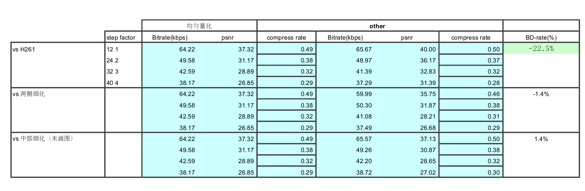
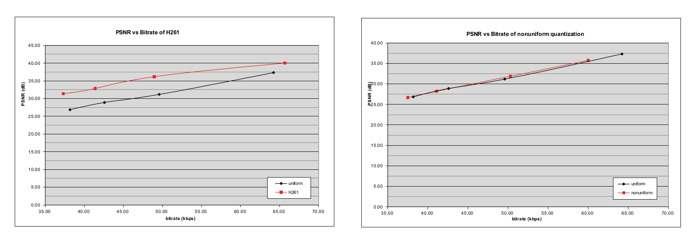

##信源编码
####无37
####刘家硕
####2013011212

---

###Part I 分工

####量化

1. 画 R-D 曲线图。设计 4 个不同步长的均匀量化器，将其比特率，PSNR 绘制在 R-D 图中，用线段
连接。横轴为比特率，纵轴为 PSNR。
2. 练习 JPEG/H.261 量化器，绘制 R-D 图。
3. 设计非均匀量化器，绘制 R-D 图。
4. 对三类量化器进行评价。

####变长编码（独立符号）

1. 设计变长编码器，用变长码对量化后的图象编码。输入符号（象素）进行独立编码。
2. 给出编码前后的比特数，计算压缩比。

####变长编码（两符号联合）

1. 设计变长编码器，用变长码对量化后的图象编码。输入符号（象素）进行独立编码。
2. 给出编码前后的比特数，计算压缩比。

---

###Part II 模块实现

我负责的是量化部分，主要通过提供的程序测量

+ 均匀量化

+ H261量化

+ 非均匀量化

的 bitrate(proccessed bits) 和 PSNR

然后通过 Performance.xls 中的宏计算 bdrate 比较量化性能以及作图

我设计了两种非均匀量化方法，这里给出较优（几乎没有差别）的一种量化序列设计程序

```python
import sys

step = int(sys.argv[1])
array = []

idx = 0
while idx <= 255:
	array.append(idx)
	if idx < 123:
		step += 1
		idx += step
	else:
		step -= 1
		idx += step

for i in array:
	print(i,end=' ')
```

可根据输入步长设计由密变疏再变密的中部稀疏量化

另一种量化方式是中部密集量化，效果不如均匀量化（差距很小）

---

###Part III 实验结果





可见H261远优于均匀量化，另两种非均匀量化性能和均匀差不多。其实应该存在最优量化方式，使得重建数值在区间的重心而区间边界为相邻重建数值的中值，但由于所提供程序中重建数值为区间中值，故无法实现这种最优。
