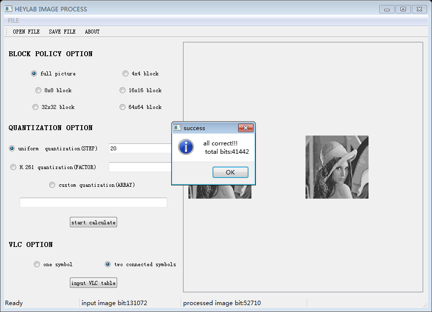

% 信源编码
% 无36
  李思涵
  2013011187
  <lisihan969@gmail.com>
% \today

# 分工

我们组的成员如下：

- 2013011187 李思涵
- 2013011212 刘家硕
- 2013011166 陈馨瑶


这次作业被托管在了 Github 上

<https://github.com/IntroductionOfCoding2015/source-coding>

我们将任务分成了三部分，其中我负责完成第三部分。具体任务划分如下：

## 量化

1. 画 R-D 曲线图。设计 4 个不同步长的均匀量化器，将其比特率，PSNR 绘制在 R-D 图中，用线段
连接。横轴为比特率，纵轴为 PSNR。
2. 练习 JPEG/H.261 量化器，绘制 R-D 图。
3. 设计非均匀量化器，绘制 R-D 图。
4. 对三类量化器进行评价。

## 变长编码（独立符号）

1. 设计变长编码器，用变长码对量化后的图象编码。输入符号（象素）进行独立编码。
2. 给出编码前后的比特数，计算压缩比。

## 变长编码（两符号联合）

1. 设计变长编码器，用变长码对量化后的图象编码。输入符号（象素）进行独立编码。
2. 给出编码前后的比特数，计算压缩比。

# 模块实现

以下列出了我负责部分的实现代码。该部分代码从 `zw/quantImage.txt` 中读出量化后的码流，并将
其两个两个一组进行组合，形成组合符号。然后其对组合符号的出现进行统计，并加入出现概率为 0 的
一项，代表 escape 符号。最后其计算符号对应的 Huffman 码表，打印出来。具体代码如下：

```matlab
BIT_STR_FILE = 'zw/quantImage.txt';

bits = fileread(BIT_STR_FILE);
bytes = reshape(bits, 8, length(bits)/8)';
syms = bin2dec(bytes);

% Combine symbol pairs.
sym_pairs = reshape(syms, [2, length(syms) / 2]);
syms = sym_pairs(1, :) * 256 + sym_pairs(2, :);

% Generate codes.
counts = histcounts(syms, [unique(syms), max(syms) + 1]);
p = counts / sum(counts);
dict = huffmandict([unique(syms) 0], [p 0]);

% Print codes
for k = 1:size(dict, 1)-1  % Ignore the last one (escape).
    sym = dict{k, 1};
    code = int2str(dict{k, 2}')';

    fprintf('%d %d %s\n', floor(sym / 256), mod(sym, 256), code);
end
disp(int2str(dict{end, 2}')');
```

# 实验结果


